<a href="https://linkedin.com/in/pinix">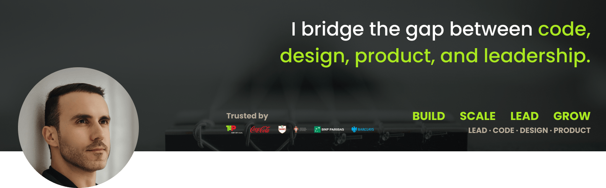</a>

  
  
  ___
  
  
  

---

# About Me

**Engineering Leader | 2x Founder | 17+ Years of Experience | 60+ Projects Delivered**

I bridge the gap between code, design, product, and leadership.

- **EXPERIENCE:** Delivered 60+ projects across industries — from lean MVPs to enterprise platforms
- **CLIENTS:** Worked with global brands including TAP Portugal, Coca-Cola, Sagres, Federação Portuguesa de Futebol, BNP Paribas, and Barclays
- **LEADERSHIP:** Scaled and managed 15+ developer teams, mentoring and setting direction
- **ENGINEERING:** Hands-on builder of scalable Front-End systems, Component Libraries, and Design Systems
- **DEVELOPER EXPERIENCE (DX):** Created tools, workflows, and guidelines to accelerate delivery and raise code quality
- **DESIGN & PRODUCT:** Align design and engineering to ensure usability, consistency, and business value
- **AI & AUTOMATION:** Integrated AI into workflows and products to boost efficiency, reduce repetition, and unlock new capabilities
- **MINDSET:** Move fluidly between strategy and execution — I speak both "tech" and "exec"
- **FOCUS:** Connecting people, technology, and purpose to ship products that matter

**💪 I'm hands-on, proactive, and outcome-driven.**

---

# 🚀 Technologies

### Front-End Frameworks

  
  
  <a href="https://angular.io" target="blank">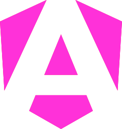</a>
  <a href="https://vuejs.org" target="blank">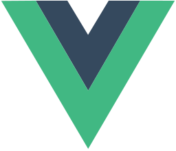</a>
  <a href="https://preactjs.com" target="blank">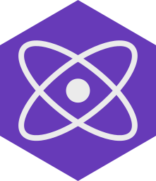</a>
  
  
  
  
  <a href="https://analogjs.org" target="blank">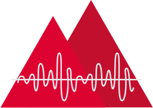</a>
  <a href="https://nuxt.com" target="blank">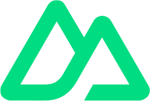</a>
  
  <a href="https://qwik.builder.io" target="blank">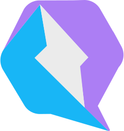</a>
  
  
  
  
  

 

### Mobile Development

  <a href="https://reactnative.dev" target="blank">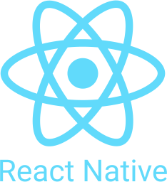</a>
  
  
  <a href="https://ionicframework.com" target="blank">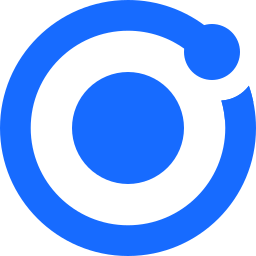</a>
  
  
  
  
  
  <a href="https://glow-ui.xyz" target="blank">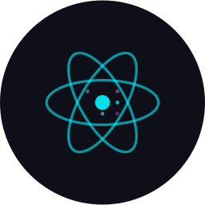</a>
  
  
  <a href="https://cordova.apache.org" target="blank" style="filter: drop-shadow(0px 0px 0.5px rgba(0, 0, 0, 1));">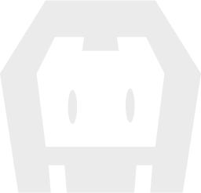</a>
  
  

 

### Languages

  <a href="https://typescriptlang.org" target="blank">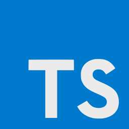</a>
  
  
  
  <a href="https://dart.dev" target="blank">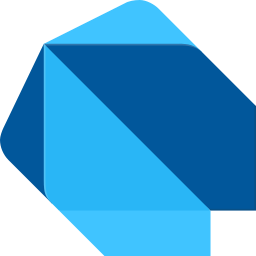</a>
  <a href="https://python.org" target="blank">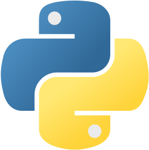</a>
  <a href="https://ecma-international.org" target="blank">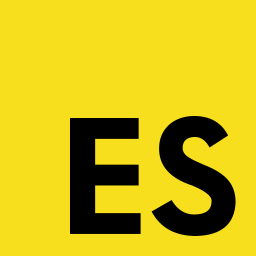</a>
  
  
  
  
  
  
  
  
  

 

### Styling & CSS

  <a href="https://www.w3.org/TR/CSS" target="blank">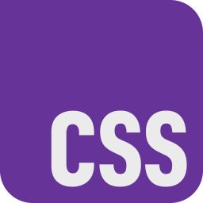</a>
  
  
  <a href="https://unocss.dev" target="blank">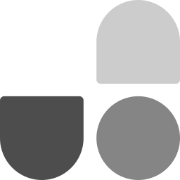</a>
  
  <a href="https://openprops.dev" target="blank">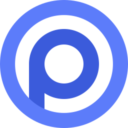</a>
  <a href="https://getbootstrap.com" target="blank">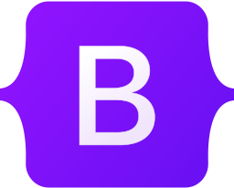</a>
  <a href="https://styled-components.com" target="blank" style="filter: drop-shadow(0px 0px 0.5px rgba(0, 0, 0, 1));">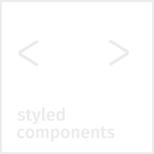</a>
  
  <a href="https://emotion.sh" target="blank">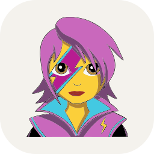</a>
  
  <a href="https://cssmodules.github.io" target="blank" style="filter: drop-shadow(0px 0px 0.5px rgba(0, 0, 0, 1));">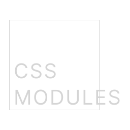</a>
  
  
  <a href="https://www.w3.org/TR/css-variables" target="blank">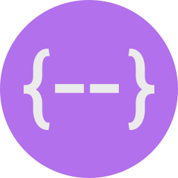</a>
  <a href="https://postcss.org" target="blank">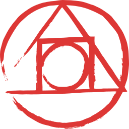</a>
  <a href="https://purecss.io" target="blank">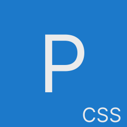</a>
  <a href="https://bulma.io" target="blank">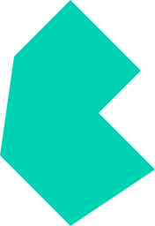</a>
  
  

 

### Component Libraries

  <a href="https://shadcn.com" target="blank" style="filter: drop-shadow(0px 0px 0.5px rgba(0, 0, 0, 1));">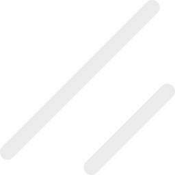</a>
  
  
  
  
  
  
  <a href="https://material.angular.io" target="blank">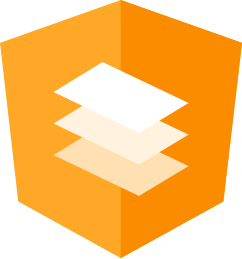</a>
  
  
  <a href="https://react-spectrum.adobe.com/react-aria" target="blank">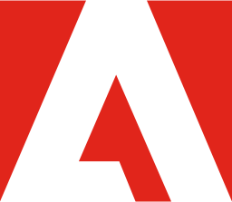</a>
  
  
  
  <a href="https://flyonui.com" target="blank">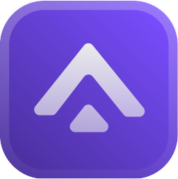</a>
  
  
  <a href="https://ant.design" target="blank">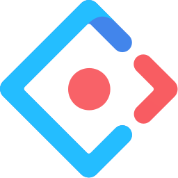</a>
  
  

 

### Animation

  <a href="https://greensock.com" target="blank">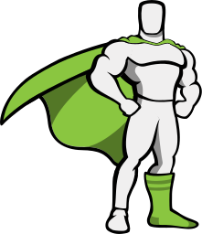</a>
  
  
  <a href="https://airbnb.io/lottie" target="blank">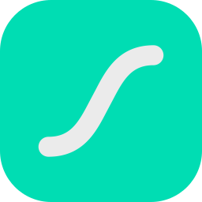</a>

 

### Back-End, APIs & Infrastructure

  
  
  
  
  
  
  
  <a href="https://deno.com" target="blank" style="filter: drop-shadow(0px 0px 0.5px rgba(0, 0, 0, 1));">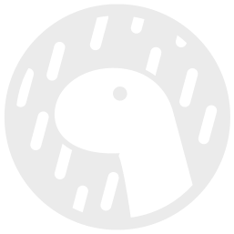</a>
  <a href="https://restfulapi.net" target="blank" style="filter: drop-shadow(0px 0px 0.5px rgba(0, 0, 0, 1));">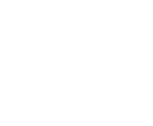</a>
  <a href="https://graphql.org" target="blank">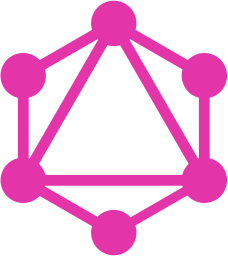</a>
  

 

### Database

  
  
  
  
  <a href="https://firebase.google.com" target="blank">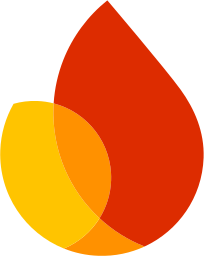</a>
  
  
  

 

### ORM & ODM

  
  <a href="https://prisma.io" target="blank" style="filter: drop-shadow(0px 0px 0.5px rgba(0, 0, 0, 1));">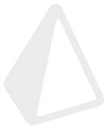</a>
  

 

### Testing

  
  
  
  
  
  <a href="https://storybook.js.org" target="blank">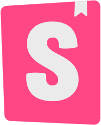</a>

 

### State & Reactive

  
  <a href="https://react-query.tanstack.com" target="blank">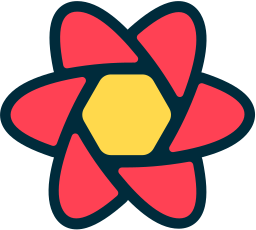</a>
  
  
  
  <a href="https://akitaonrails.org" target="blank">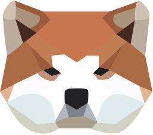</a>
  
  
  
  
  

 

### Auth

  <a href="https://betterauth.dev" target="blank" style="filter: drop-shadow(0px 0px 0.5px rgba(0, 0, 0, 1));">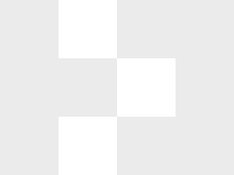</a>
  
  
  
  <a href="https://clerk.dev" target="blank">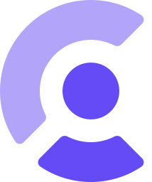</a>
  
  <a href="https://openauth.dev" target="blank" style="filter: drop-shadow(0px 0px 0.5px rgba(0, 0, 0, 1));">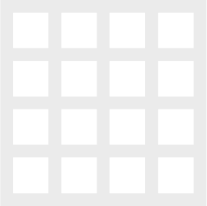</a>
  

 

### Design & Prototyping

  <a href="https://figma.com" target="blank">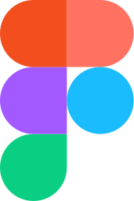</a>
  <a href="https://sketch.com" target="blank">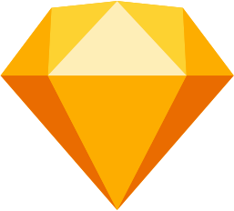</a>
  
  <a href="https://www.adobe.com/products/photoshop.html" target="blank">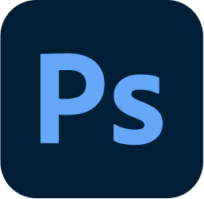</a>
  <a href="https://www.adobe.com/products/illustrator.html" target="blank">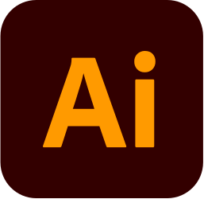</a>
  
  
  <a href="https://framer.com" target="blank" style="filter: drop-shadow(0px 0px 0.5px rgba(0, 0, 0, 1));">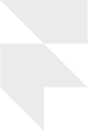</a>
  <a href="https://flinto.com" target="blank">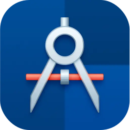</a>
  
  
  

 

### Photo

  
  
  
  

 

### Video

  
  
  

 

### 3D & Modeling

  
  
  
  
  
  
  
  
  

 

### E-Learning

  
  
  
  
  
  
  

