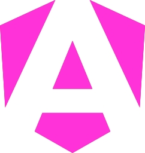
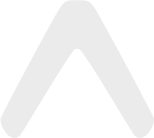
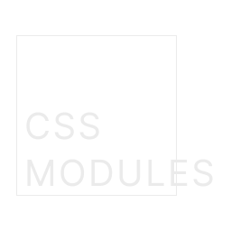
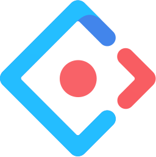
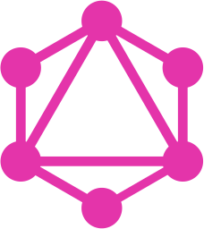
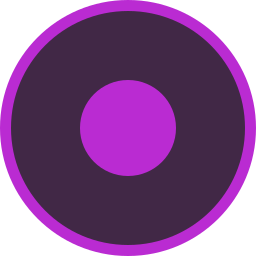
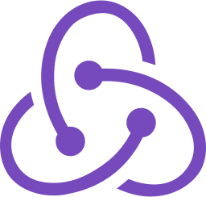
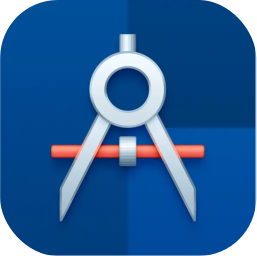

  
  
  ___
  
  
  

---

# About Me

**Engineering Leader | 2x Founder | 17+ Years of Experience | 60+ Projects Delivered**

I bridge the gap between code, design, product, and leadership.

- **EXPERIENCE:** Delivered 60+ projects across industries — from lean MVPs to enterprise platforms
- **CLIENTS:** Worked with global brands including TAP Portugal, Coca-Cola, Sagres, Federação Portuguesa de Futebol, BNP Paribas, and Barclays
- **LEADERSHIP:** Scaled and managed 15+ developer teams, mentoring and setting direction
- **ENGINEERING:** Hands-on builder of scalable Front-End systems, Component Libraries, and Design Systems
- **DEVELOPER EXPERIENCE (DX):** Created tools, workflows, and guidelines to accelerate delivery and raise code quality
- **DESIGN & PRODUCT:** Align design and engineering to ensure usability, consistency, and business value
- **AI & AUTOMATION:** Integrated AI into workflows and products to boost efficiency, reduce repetition, and unlock new capabilities
- **MINDSET:** Move fluidly between strategy and execution — I speak both "tech" and "exec"
- **FOCUS:** Connecting people, technology, and purpose to ship products that matter

**💪 I'm hands-on, proactive, and outcome-driven.**

---

# 🚀 Technologies

### Front-End Frameworks

  
  
  
  
  
  
  
  
  
  
  
  
  
  
  
  
  
  

 

### Mobile Development

  
  
  
  
  
  
  
  
  
  
  
  
  
  
  

 

### Languages

  
  
  
  
  
  
  
  
  
  
  
  
  
  
  
  

 

### Styling & CSS

  
  
  
  
  
  
  
  
  
  
  
  
  
  
  
  
  
  
  
  

 

### Component Libraries

  
  
  
  
  
  
  
  
  
  
  
  
  
  
  
  
  
  
  
  

 

### Animation

  
  
  
  

 

### Back-End, APIs & Infrastructure

  
  
  
  
  
  
  
  
  
  
  

 

### Database

  
  
  
  
  
  
  
  

 

### ORM & ODM

  
  
  

 

### Testing

  
  
  
  
  
  

 

### State & Reactive

  
  
  
  
  
  
  
  
  
  
  

 

### Auth

  
  
  
  
  
  
  
  

 

### Design & Prototyping

  
  
  
  
  
  
  
  
  
  
  
  

 

### Photo

  
  
  
  

 

### Video

  
  
  

 

### 3D & Modeling

  
  
  
  
  
  
  
  
  

 

### E-Learning

  
  
  
  
  
  
  

