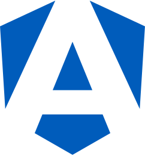
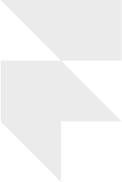
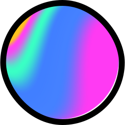

  <a href="https://apinix.com" target="blank" style="height: 30px; display: inline-flex; margin: 4px; border-radius: 500rem; align-items: center; background: #AAE920; padding-left: 0.25rem; padding-right: 0.75rem;">
    
    apinix.com
  </a>
  <a href="https://linkedin.com/in/pinix" target="blank" style="height: 30px; display: inline-flex; margin: 4px; border-radius: 500rem; align-items: center; background: #0A66C2; padding-inline: 0.75rem;">
    
    LinkedIn
  </a>
  <a href="https://x.com/apinix" target="blank" style="height: 30px; display: inline-flex; margin: 4px; border-radius: 500rem; align-items: center; background: #000000; padding-inline: 0.75rem;">
    
    x.com
  </a>
  <a href="https://instagram.com/pinixband" target="blank" style="height: 30px; display: inline-flex; margin: 4px; border-radius: 500rem; align-items: center; background: radial-gradient(92.18% 99.11% at 26.56% 107.7%, #FD5 0%, #FD5 10%, #FF543E 50%, #C837AB 100%); padding-left: 0.55rem; padding-right: 0.75rem;">
    
    Instagram
  </a>
  <a href="mailto:a.pinix@gmail.com" target="blank" style="height: 30px; display: inline-flex; margin: 4px; border-radius: 500rem; align-items: center; background: #94a3b8; padding-inline: 0.75rem;">
    ✉️
    Email
  </a>

---

# About

**Engineering Leader | 2x Founder | 17+ Years of Experience | 60+ Projects Delivered**

I bridge the gap between code, design, product, and leadership.

- **EXPERIENCE:** Delivered 60+ projects across industries — from lean MVPs to enterprise platforms
- **CLIENTS:** Worked with global brands including TAP Portugal, Coca-Cola, Sagres, Federação Portuguesa de Futebol, BNP Paribas, and Barclays
- **LEADERSHIP:** Scaled and managed 15+ developer teams, mentoring and setting direction
- **ENGINEERING:** Hands-on builder of scalable Front-End systems, Component Libraries, and Design Systems
- **DEVELOPER EXPERIENCE (DX):** Created tools, workflows, and guidelines to accelerate delivery and raise code quality
- **DESIGN & PRODUCT:** Align design and engineering to ensure usability, consistency, and business value
- **AI & AUTOMATION:** Integrated AI into workflows and products to boost efficiency, reduce repetition, and unlock new capabilities
- **MINDSET:** Move fluidly between strategy and execution — I speak both "tech" and "exec"
- **FOCUS:** Connecting people, technology, and purpose to ship products that matter

**💪 I'm hands-on, proactive, and outcome-driven.**

---

# 🚀 Technologies

### Front-End Frameworks

  
  
  
  
  
  
  
  
  
  
  
  
  
  
  
  
  
  

 

### Mobile Development

  
  
  
  
  
  
  
  
  
  
  
  
  
  
  

 

### Languages

  
  
  
  
  
  
  
  
  
  
  
  
  
  
  
  

 

### Styling & CSS

  
  
  
  
  
  
  
  
  
  
  
  
  
  
  
  
  
  
  
  

 

### Component Libraries

  
  
  
  
  
  
  
  
  
  
  
  
  
  
  
  
  
  
  
  

 

### Animation

  
  
  
  

 

### Back-End, APIs & Infrastructure

  
  
  
  
  
  
  
  
  
  
  

 

### Database

  
  
  
  
  
  
  
  

 

### ORM & ODM

  
  
  

 

### Testing

  
  
  
  
  
  

 

### State & Reactive

  
  
  
  
  
  
  
  
  
  
  

 

### Auth

  
  
  
  
  
  
  
  

 

### Design & Prototyping

  
  
  
  
  
  
  
  
  
  
  
  

 

### Photo

  
  
  
  

 

### Video

  
  
  

 

### 3D & Modeling

  
  
  
  
  
  
  
  
  

 

### E-Learning

  
  
  
  
  
  
  

