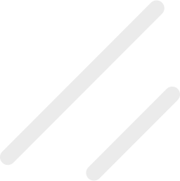
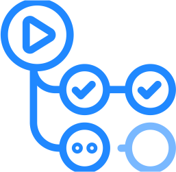
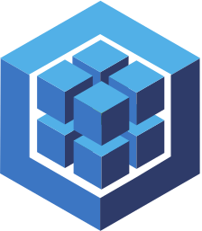
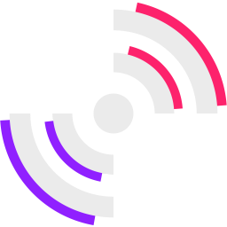

  
  
  
  
  

---

# About Me

**Engineering Leader | 2x Founder | 17+ Years of Experience | 60+ Projects Delivered**

I bridge the gap between code, design, product, and leadership.

- **EXPERIENCE:** Delivered 60+ projects across industries — from lean MVPs to enterprise platforms
- **CLIENTS:** Worked with global brands including TAP Portugal, Coca-Cola, Sagres, Federação Portuguesa de Futebol, BNP Paribas, and Barclays
- **LEADERSHIP:** Scaled and managed 15+ developer teams, mentoring and setting direction
- **ENGINEERING:** Hands-on builder of scalable Front-End systems, Component Libraries, and Design Systems
- **DEVELOPER EXPERIENCE (DX):** Created tools, workflows, and guidelines to accelerate delivery and raise code quality
- **DESIGN & PRODUCT:** Align design and engineering to ensure usability, consistency, and business value
- **AI & AUTOMATION:** Integrated AI into workflows and products to boost efficiency, reduce repetition, and unlock new capabilities
- **MINDSET:** Move fluidly between strategy and execution — I speak both "tech" and "exec"
- **FOCUS:** Connecting people, technology, and purpose to ship products that matter

**💪 I'm hands-on, proactive, and outcome-driven.**

---

# 🚀 Technologies

### Front-End Frameworks

|                                                                                                                                                           |                                                                                                                                                              |                                                                                                                                                                        |                                                                                                                                                             |                                                                                                                                                             |                                                                                                                                                                              |
| :-------------------------------------------------------------------------------------------------------------------------------------------------------: | :----------------------------------------------------------------------------------------------------------------------------------------------------------: | :--------------------------------------------------------------------------------------------------------------------------------------------------------------------: | :---------------------------------------------------------------------------------------------------------------------------------------------------------: | :---------------------------------------------------------------------------------------------------------------------------------------------------------: | :--------------------------------------------------------------------------------------------------------------------------------------------------------------------------: |
|  <a href="https://reactjs.org" title="React"> <b>React</b></a>   | <a href="https://nextjs.org" title="Next.js"> <b>Next.js</b></a> |     <a href="https://angular.io" title="Angular"> <b>Angular</b></a>      |    <a href="https://vuejs.org" title="Vue.js"> <b>Vue.js</b></a>    | <a href="https://preactjs.com" title="Preact"> <b>Preact</b></a> |      <a href="https://solidjs.com" title="Solid.js"> <b>Solid.js</b></a>       |
| <a href="https://svelte.dev" title="Svelte"> <b>Svelte</b></a> |    <a href="https://astro.build" title="Astro"> <b>Astro</b></a>    | <a href="https://alpinejs.dev" title="Alpine.js"> <b>Alpine.js</b></a> | <a href="https://analogjs.org" title="Analog"> <b>Analog</b></a> | <a href="https://gatsbyjs.org" title="Gatsby"> <b>Gatsby</b></a> | <a href="https://www.sencha.com/products/extjs/" title="Ext JS"> <b>Ext JS</b></a> |

 

### Mobile Development

|                                                                                                                                                                                         |                                                                                                                                                                                    |                                                                                                                                                                |                                                                                                                                                                                                           |                                                                                                                                                                                         |                                                                                                                                                                                            |
| :-------------------------------------------------------------------------------------------------------------------------------------------------------------------------------------: | :--------------------------------------------------------------------------------------------------------------------------------------------------------------------------------: | :------------------------------------------------------------------------------------------------------------------------------------------------------------: | :-------------------------------------------------------------------------------------------------------------------------------------------------------------------------------------------------------: | :-------------------------------------------------------------------------------------------------------------------------------------------------------------------------------------: | :----------------------------------------------------------------------------------------------------------------------------------------------------------------------------------------: |
| <a href="https://reactnative.dev" title="React Native"> <b>React Native</b></a>  |                  <a href="https://expo.dev" title="Expo"> <b>Expo</b></a>                   | <a href="https://flutter.dev" title="Flutter"> <b>Flutter</b></a> | <a href="https://ionicframework.com" title="Ionic Framework"> <b>Ionic Framework</b></a> | <a href="https://nativescript.org" title="NativeScript"> <b>NativeScript</b></a> |       <a href="https://nativewind.dev" title="Nativewind"> <b>Nativewind</b></a>        |
| <a href="https://gluestack-ui.com" title="Gluestack UI"> <b>Gluestack UI</b></a> | <a href="https://rnreusables.com" title="rnreusables"> <b>rnreusables</b></a> | <a href="https://hero-ui.com" title="Hero UI"> <b>Hero UI</b></a> |                      <a href="https://glow-ui.xyz" title="Glow UI"> <b>Glow UI</b></a>                       |       <a href="https://capacitorjs.com" title="Capacitor"> <b>Capacitor</b></a>        | <a href="https://cordova.apache.org" title="Apache Cordova"> <b>Apache Cordova</b></a> |

 

### Languages

|                                                                                                                                                                                       |                                                                                                                                                                                         |                                                                                                                                                                                   |                                                                                                                                                   |                                                                                                                                                 |                                                                                                                                                           |
| :-----------------------------------------------------------------------------------------------------------------------------------------------------------------------------------: | :-------------------------------------------------------------------------------------------------------------------------------------------------------------------------------------: | :-------------------------------------------------------------------------------------------------------------------------------------------------------------------------------: | :-----------------------------------------------------------------------------------------------------------------------------------------------: | :---------------------------------------------------------------------------------------------------------------------------------------------: | :-------------------------------------------------------------------------------------------------------------------------------------------------------: |
|   <a href="https://typescriptlang.org" title="TypeScript"> <b>TypeScript</b></a>   |      <a href="https://javascript.com" title="JavaScript"> <b>JavaScript</b></a>      |                  <a href="https://html.com" title="HTML"> <b>HTML</b></a>                  |    <a href="https://php.net" title="PHP"> <b>PHP</b></a>     | <a href="https://dart.dev" title="Dart"> <b>Dart</b></a> | <a href="https://python.org" title="Python"> <b>Python</b></a> |
| <a href="https://ecma-international.org" title="ECMAScript"> <b>ECMAScript</b></a> | <a href="https://coffeescript.org" title="CoffeeScript"> <b>CoffeeScript</b></a> |                  <a href="https://json.org" title="JSON"> <b>JSON</b></a>                  | <a href="https://www.w3.org/XML" title="XML"> <b>XML</b></a> | <a href="https://yaml.org" title="YAML"> <b>YAML</b></a> |       <a href="https://pugjs.org" title="Pug"> <b>Pug</b></a>        |
|                 <a href="https://jade-lang.com" title="Jade"> <b>Jade</b></a>                  |                  <a href="https://slim-lang.com" title="Slim"> <b>Slim</b></a>                   | <a href="https://mozilla.github.io/nunjucks" title="Nunjucks"> <b>Nunjucks</b></a> |                                                                                                                                                   |                                                                                                                                                 |                                                                                                                                                           |

 

### Styling & CSS

|                                                                                                                                                                                                                      |                                                                                                                                                                                                                                        |                                                                                                                                                                                       |                                                                                                                                                                                                        |                                                                                                                                                                                                      |                                                                                                                                                                               |
| :------------------------------------------------------------------------------------------------------------------------------------------------------------------------------------------------------------------: | :------------------------------------------------------------------------------------------------------------------------------------------------------------------------------------------------------------------------------------: | :-----------------------------------------------------------------------------------------------------------------------------------------------------------------------------------: | :----------------------------------------------------------------------------------------------------------------------------------------------------------------------------------------------------: | :--------------------------------------------------------------------------------------------------------------------------------------------------------------------------------------------------: | :---------------------------------------------------------------------------------------------------------------------------------------------------------------------------: |
|                                 <a href="https://www.w3.org/TR/CSS" title="CSS"> <b>CSS</b></a>                                 |                                          <a href="https://sass-lang.com" title="Sass"> <b>Sass</b></a>                                          | <a href="https://tailwindcss.com" title="Tailwind CSS"> <b>Tailwind CSS</b></a> |                       <a href="https://unocss.dev" title="UnoCSS"> <b>UnoCSS</b></a>                        |            <a href="https://nativewind.dev" title="NativeWind"> <b>NativeWind</b></a>             |  <a href="https://getbootstrap.com" title="Bootstrap"> <b>Bootstrap</b></a>  |
| <a href="https://styled-components.com" title="Styled Components"> <b>Styled Components</b></a> |                                       <a href="https://stylex.dev" title="StyleX"> <b>StyleX</b></a>                                        |             <a href="https://emotion.sh" title="Emotion"> <b>Emotion</b></a>             | <a href="https://vanilla-extract.dev" title="Vanilla Extract"> <b>Vanilla Extract</b></a> | <a href="https://css-modules.github.io/css-modules" title="CSS Modules"> <b>CSS Modules</b></a> |              <a href="https://lesscss.org" title="Less"> <b>Less</b></a>               |
|                            <a href="https://stylus-lang.com" title="Stylus"> <b>Stylus</b></a>                            | <a href="https://www.w3.org/TR/css-variables" title="CSS Custom Properties"> <b>CSS Custom Properties</b></a> |            <a href="https://postcss.org" title="PostCSS"> <b>PostCSS</b></a>             |                   <a href="https://purecss.io" title="Pure CSS"> <b>Pure CSS</b></a>                    |                         <a href="https://bulma.io" title="Bulma"> <b>Bulma</b></a>                          | <a href="https://get.foundation" title="Foundation"> <b>Foundation</b></a> |
|                  <a href="https://semantic-ui.com" title="Semantic UI"> <b>Semantic UI</b></a>                  |                                                                                                                                                                                                                                        |                                                                                                                                                                                       |                                                                                                                                                                                                        |                                                                                                                                                                                                      |                                                                                                                                                                               |

 

### Component Libraries

|                                                                                                                                                                       |                                                                                                                                                                                                            |                                                                                                                                                                                    |                                                                                                                                                                           |                                                                                                                                                                                                    |                                                                                                                                                                                    |
| :-------------------------------------------------------------------------------------------------------------------------------------------------------------------: | :--------------------------------------------------------------------------------------------------------------------------------------------------------------------------------------------------------: | :--------------------------------------------------------------------------------------------------------------------------------------------------------------------------------: | :-----------------------------------------------------------------------------------------------------------------------------------------------------------------------: | :------------------------------------------------------------------------------------------------------------------------------------------------------------------------------------------------: | :--------------------------------------------------------------------------------------------------------------------------------------------------------------------------------: |
| <a href="https://shadcn.com" title="shadcn/ui"> <b>shadcn/ui</b></a> |                  <a href="https://originui.com" title="Origin UI"> <b>Origin UI</b></a>                   |           <a href="https://hero-ui.com" title="Hero UI"> <b>Hero UI</b></a>           |      <a href="https://glow-ui.xyz" title="Glow UI"> <b>Glow UI</b></a>       |      <a href="https://gluestack-ui.com" title="Gluestack UI"> <b>Gluestack UI</b></a>       | <a href="https://rnreusables.com" title="rnreusables"> <b>rnreusables</b></a> |
|    <a href="https://primeng.org" title="PrimeNG"> <b>PrimeNG</b></a>     | <a href="https://material.angular.io" title="Angular Material"> <b>Angular Material</b></a> |        <a href="https://radix-ui.com" title="Radix UI"> <b>Radix UI</b></a>         |     <a href="https://baseui.design" title="Base UI"> <b>Base UI</b></a>      | <a href="https://react-spectrum.adobe.com/react-aria" title="React Aria"> <b>React Aria</b></a> |      <a href="https://chakra-ui.com" title="Chakra UI"> <b>Chakra UI</b></a>      |
|    <a href="https://daisyui.com" title="daisyUI"> <b>daisyUI</b></a>    |                 <a href="https://mui.com" title="Material-UI"> <b>Material-UI</b></a>                 | <a href="https://semantic-ui.com" title="Semantic UI"> <b>Semantic UI</b></a> | <a href="https://ant.design" title="Ant Design"> <b>Ant Design</b></a> |         <a href="https://headlessui.com" title="Headless UI"> <b>Headless UI</b></a>          |           <a href="https://mantine.dev" title="Mantine"> <b>Mantine</b></a>           |

 

### Animation

|                                                                                                                                                      |                                                                                                                                                                                       |                                                                                                                                                                   |                                                                                                                                                                 |
| :--------------------------------------------------------------------------------------------------------------------------------------------------: | :-----------------------------------------------------------------------------------------------------------------------------------------------------------------------------------: | :---------------------------------------------------------------------------------------------------------------------------------------------------------------: | :-------------------------------------------------------------------------------------------------------------------------------------------------------------: |
| <a href="https://greensock.com" title="GSAP"> <b>GSAP</b></a> | <a href="https://framer.com/motion" title="Framer Motion"> <b>Framer Motion</b></a> | <a href="https://animejs.com" title="Anime.js"> <b>Anime.js</b></a> | <a href="https://airbnb.io/lottie" title="Lottie"> <b>Lottie</b></a> |

 

### Back-End, APIs & Infrastructure

|                                                                                                                                                              |                                                                                                                                                 |                                                                                                                                                                           |                                                                                                                                                                |                                                                                                                                                                                                            |                                                                                                                                                                     |
| :----------------------------------------------------------------------------------------------------------------------------------------------------------: | :---------------------------------------------------------------------------------------------------------------------------------------------: | :-----------------------------------------------------------------------------------------------------------------------------------------------------------------------: | :------------------------------------------------------------------------------------------------------------------------------------------------------------: | :--------------------------------------------------------------------------------------------------------------------------------------------------------------------------------------------------------: | :-----------------------------------------------------------------------------------------------------------------------------------------------------------------: |
| <a href="https://nodejs.org" title="Node.js"> <b>Node.js</b></a> | <a href="https://hono.dev" title="Hono"> <b>Hono</b></a> | <a href="https://expressjs.com" title="Express.js"> <b>Express.js</b></a> |   <a href="https://docker.com" title="Docker"> <b>Docker</b></a>    | <a href="https://github.com/features/actions" title="GitHub Actions"> <b>GitHub Actions</b></a> | <a href="https://circleci.com" title="CircleCI"> <b>CircleCI</b></a> |
|          <a href="https://bun.sh" title="Bun"> <b>Bun</b></a>           | <a href="https://deno.com" title="Deno"> <b>Deno</b></a> |     <a href="https://restfulapi.net" title="REST API"> <b>REST API</b></a>     | <a href="https://graphql.org" title="GraphQL"> <b>GraphQL</b></a> |                       <a href="https://jenkins.io" title="Jenkins"> <b>Jenkins</b></a>                        |                                                                                                                                                                     |

 

### Database

|                                                                                                                                                                               |                                                                                                                                                                |                                                                                                                                                                     |                                                                                                                                                  |                                                                                                                                                                            |                                                                                                                                                      |
| :---------------------------------------------------------------------------------------------------------------------------------------------------------------------------: | :------------------------------------------------------------------------------------------------------------------------------------------------------------: | :-----------------------------------------------------------------------------------------------------------------------------------------------------------------: | :----------------------------------------------------------------------------------------------------------------------------------------------: | :------------------------------------------------------------------------------------------------------------------------------------------------------------------------: | :--------------------------------------------------------------------------------------------------------------------------------------------------: |
| <a href="https://postgresql.org" title="PostgreSQL"> <b>PostgreSQL</b></a> | <a href="https://mongodb.com" title="MongoDB"> <b>MongoDB</b></a> | <a href="https://supabase.com" title="Supabase"> <b>Supabase</b></a> | <a href="https://neon.tech" title="Neon"> <b>Neon</b></a> | <a href="https://firebase.google.com" title="Firebase"> <b>Firebase</b></a> | <a href="https://mysql.com" title="MySQL"> <b>MySQL</b></a> |
|           <a href="https://sqlite.org" title="SQLite"> <b>SQLite</b></a>           | <a href="https://mariadb.org" title="MariaDB"> <b>MariaDB</b></a> |                                                                                                                                                                     |                                                                                                                                                  |                                                                                                                                                                            |                                                                                                                                                      |

 

### ORM & ODM

|                                                                                                                                                                             |                                                                                                                                                          |                                                                                                                                                                       |                                                                                                                                                               |                                                                                                                                                                          |
| :-------------------------------------------------------------------------------------------------------------------------------------------------------------------------: | :------------------------------------------------------------------------------------------------------------------------------------------------------: | :-------------------------------------------------------------------------------------------------------------------------------------------------------------------: | :-----------------------------------------------------------------------------------------------------------------------------------------------------------: | :----------------------------------------------------------------------------------------------------------------------------------------------------------------------: |
| <a href="https://drizzle.team" title="Drizzle ORM"> <b>Drizzle ORM</b></a> | <a href="https://prisma.io" title="Prisma"> <b>Prisma</b></a> | <a href="https://mongoosejs.com" title="Mongoose"> <b>Mongoose</b></a> | <a href="https://typeorm.io" title="TypeORM"> <b>TypeORM</b></a> | <a href="https://sequelize.org" title="Sequelize"> <b>Sequelize</b></a> |

 

### Testing

|                                                                                                                                                           |                                                                                                                                                  |                                                                                                                                           |                                                                                                                                                                               |                                                                                                                                                               |                                                                                                                                                                             |
| :-------------------------------------------------------------------------------------------------------------------------------------------------------: | :----------------------------------------------------------------------------------------------------------------------------------------------: | :---------------------------------------------------------------------------------------------------------------------------------------: | :---------------------------------------------------------------------------------------------------------------------------------------------------------------------------: | :-----------------------------------------------------------------------------------------------------------------------------------------------------------: | :-------------------------------------------------------------------------------------------------------------------------------------------------------------------------: |
| <a href="https://vitest.dev" title="Vitest"> <b>Vitest</b></a> | <a href="https://jestjs.io" title="Jest"> <b>Jest</b></a> | <a href="https://bun.sh" title="Bun"> <b>Bun</b></a> | <a href="https://playwright.dev" title="Playwright"> <b>Playwright</b></a> | <a href="https://cypress.io" title="Cypress"> <b>Cypress</b></a> | <a href="https://storybook.js.org" title="Storybook"> <b>Storybook</b></a> |

 

### State & Reactive

|                                                                                                                                                                                                                                  |                                                                                                                                                                                                          |                                                                                                                                                          |                                                                                                                                                             |                                                                                                                                                                              |                                                                                                                                                                          |
| :------------------------------------------------------------------------------------------------------------------------------------------------------------------------------------------------------------------------------: | :------------------------------------------------------------------------------------------------------------------------------------------------------------------------------------------------------: | :------------------------------------------------------------------------------------------------------------------------------------------------------: | :---------------------------------------------------------------------------------------------------------------------------------------------------------: | :--------------------------------------------------------------------------------------------------------------------------------------------------------------------------: | :----------------------------------------------------------------------------------------------------------------------------------------------------------------------: |
|                                  <a href="https://zustand.dev" title="Zustand"> <b>Zustand</b></a>                                  | <a href="https://react-query.tanstack.com" title="TanStack Query"> <b>TanStack Query</b></a> |   <a href="https://jotai.org" title="Jotai"> <b>Jotai</b></a>   | <a href="https://github.com/nuqs/nuqs" title="nuqs"> <b>nuqs</b></a> |           <a href="https://ngneat.github.io/elf/" title="elf"> <b>elf</b></a>           | <a href="https://github.com/akitaonrails/akita" title="Akita"> <b>Akita</b></a> |
| <a href="https://github.com/DanWahlin/Observable-Store" title="Observable Store"> <b>Observable Store</b></a> |                             <a href="https://ngrx.io/" title="ngrx"> <b>ngrx</b></a>                              | <a href="https://redux.js.org/" title="Redux"> <b>Redux</b></a> |      <a href="https://rxjs.dev/" title="rxjs"> <b>rxjs</b></a>       | <a href="https://angular.dev/guide/signals" title="Signals"> <b>Signals</b></a> |                                                                                                                                                                          |

 

### Auth

|                                                                                                                                                                                   |                                                                                                                                                              |                                                                                                                                                                     |                                                                                                                                                                            |                                                                                                                                                      |                                                                                                                                                      |
| :-------------------------------------------------------------------------------------------------------------------------------------------------------------------------------: | :----------------------------------------------------------------------------------------------------------------------------------------------------------: | :-----------------------------------------------------------------------------------------------------------------------------------------------------------------: | :------------------------------------------------------------------------------------------------------------------------------------------------------------------------: | :--------------------------------------------------------------------------------------------------------------------------------------------------: | :--------------------------------------------------------------------------------------------------------------------------------------------------: |
| <a href="https://betterauth.dev" title="Better Auth"> <b>Better Auth</b></a> | <a href="https://authjs.dev" title="Auth.js"> <b>Auth.js</b></a> | <a href="https://supabase.com" title="Supabase"> <b>Supabase</b></a> | <a href="https://firebase.google.com" title="Firebase"> <b>Firebase</b></a> | <a href="https://clerk.dev" title="Clerk"> <b>Clerk</b></a> | <a href="https://kinde.com" title="Kinde"> <b>Kinde</b></a> |
|       <a href="https://openauth.js.org/" title="OpenAUTH"> <b>OpenAUTH</b></a>       |     <a href="https://auth0.com" title="Auth0"> <b>Auth0</b></a>     |                                                                                                                                                                     |                                                                                                                                                                            |                                                                                                                                                      |                                                                                                                                                      |

 

### Design & Prototyping

|                                                                                                                                                                                                                      |                                                                                                                                                           |                                                                                                                                                                                               |                                                                                                                                                                                                                              |                                                                                                                                                                                                                                        |                                                                                                                                                           |
| :------------------------------------------------------------------------------------------------------------------------------------------------------------------------------------------------------------------: | :-------------------------------------------------------------------------------------------------------------------------------------------------------: | :-------------------------------------------------------------------------------------------------------------------------------------------------------------------------------------------: | :--------------------------------------------------------------------------------------------------------------------------------------------------------------------------------------------------------------------------: | :------------------------------------------------------------------------------------------------------------------------------------------------------------------------------------------------------------------------------------: | :-------------------------------------------------------------------------------------------------------------------------------------------------------: |
|                                 <a href="https://figma.com" title="Figma"> <b>Figma</b></a>                                 | <a href="https://sketch.com" title="Sketch"> <b>Sketch</b></a> | <a href="https://pixelmator.com" title="Pixelmator Pro"> <b>Pixelmator Pro</b></a> | <a href="https://www.adobe.com/products/photoshop.html" title="Adobe Photoshop"> <b>Adobe Photoshop</b></a> | <a href="https://www.adobe.com/products/illustrator.html" title="Adobe Illustrator"> <b>Adobe Illustrator</b></a> | <a href="https://penpot.app" title="penpot"> <b>penpot</b></a> |
| <a href="https://affinity.com/designer" title="Affinity Designer"> <b>Affinity Designer</b></a> | <a href="https://framer.com" title="Framer"> <b>Framer</b></a> |                   <a href="https://flinto.com" title="Flinto"> <b>Flinto</b></a>                   |                                 <a href="https://marvelapp.com" title="Marvel"> <b>Marvel</b></a>                                 |                                     <a href="https://axure.com" title="Axure RP"> <b>Axure RP</b></a>                                      |   <a href="https://uxpin.com" title="UXPin"> <b>UXPin</b></a>    |

 

### Photo, Video, 3D & Modeling

|                                                                                                                                                                                                                                            |                                                                                                                                                                                                                              |                                                                                                                                                                                                                                        |                                                                                                                                                                                                  |                                                                                                                                                                                                                                                 |                                                                                                                                                                                                                                         |
| :----------------------------------------------------------------------------------------------------------------------------------------------------------------------------------------------------------------------------------------: | :--------------------------------------------------------------------------------------------------------------------------------------------------------------------------------------------------------------------------: | :------------------------------------------------------------------------------------------------------------------------------------------------------------------------------------------------------------------------------------: | :----------------------------------------------------------------------------------------------------------------------------------------------------------------------------------------------: | :---------------------------------------------------------------------------------------------------------------------------------------------------------------------------------------------------------------------------------------------: | :-------------------------------------------------------------------------------------------------------------------------------------------------------------------------------------------------------------------------------------: |
|                       <a href="https://pixelmator.com" title="Pixelmator Pro"> <b>Pixelmator Pro</b></a>                        | <a href="https://www.adobe.com/products/photoshop.html" title="Adobe Photoshop"> <b>Adobe Photoshop</b></a> | <a href="https://www.adobe.com/products/photoshop-lightroom.html" title="Adobe Lightroom"> <b>Adobe Lightroom</b></a> | <a href="https://affinityphoto.com" title="Affinity Photo"> <b>Affinity Photo</b></a> | <a href="https://www.adobe.com/products/aftereffects.html" title="Adobe After Effects"> <b>Adobe After Effects</b></a> | <a href="https://www.adobe.com/products/premiere.html" title="Adobe Premiere Pro"> <b>Adobe Premiere Pro</b></a> |
| <a href="https://www.apple.com/final-cut-pro/?cid=oas-us-domains-finalcutpro.com" title="Final Cut Pro"> <b>Final Cut Pro</b></a> |                <a href="https://www.autodesk.com/products/3ds-max/overview" title="3ds Max"> <b>3ds Max</b></a>                 |                                   <a href="https://threejs.org" title="Three.js"> <b>Three.js</b></a>                                    |                   <a href="https://spline.design" title="Spline"> <b>Spline</b></a>                   |                                    <a href="https://sketchfab.com" title="Sketchfab"> <b>Sketchfab</b></a>                                     |                           <a href="https://sketchup.com" title="SketchUp Pro"> <b>SketchUp Pro</b></a>                           |
|                           <a href="https://www.maxon.net/en/cinema-4d" title="Cinema 4D"> <b>Cinema 4D</b></a>                            |                                <a href="https://blender.org" title="Blender"> <b>Blender</b></a>                                |                                            <a href="https://womp.com" title="Womp"> <b>Womp</b></a>                                             |                <a href="https://www.posersoftware.com/" title="Poser"> <b>Poser</b></a>                 |                                                                                                                                                                                                                                                 |                                                                                                                                                                                                                                         |

 

### E-Learning

|                                                                                                                                                                                                        |                                                                                                                                                           |                                                                                                                                                                          |                                                                                                                                                                                                     |                                                                                                                                                                                                                              |                                                                                                                                                                                                                                               |
| :----------------------------------------------------------------------------------------------------------------------------------------------------------------------------------------------------: | :-------------------------------------------------------------------------------------------------------------------------------------------------------: | :----------------------------------------------------------------------------------------------------------------------------------------------------------------------: | :-------------------------------------------------------------------------------------------------------------------------------------------------------------------------------------------------: | :--------------------------------------------------------------------------------------------------------------------------------------------------------------------------------------------------------------------------: | :-------------------------------------------------------------------------------------------------------------------------------------------------------------------------------------------------------------------------------------------: |
|                         <a href="https://scorm.com/" title="SCORM"> <b>SCORM</b></a>                          | <a href="https://moodle.org" title="Moodle"> <b>Moodle</b></a> | <a href="https://talentlms.com" title="TalentLMS"> <b>TalentLMS</b></a> | <a href="https://www.exactls.com/" title="Exact Packager"> <b>Exact Packager</b></a> | <a href="https://www.adobe.com/products/captivate.html" title="Adobe Captivate"> <b>Adobe Captivate</b></a> | <a href="https://www.articulate.com/360/studio/" title="Articulate Studio 360"> <b>Articulate Studio 360</b></a> |
| <a href="https://www1.formare.pt/demo/mobile/termos.aspx" title="PT Formare"> <b>PT Formare</b></a> |                                                                                                                                                           |                                                                                                                                                                          |                                                                                                                                                                                                     |                                                                                                                                                                                                                              |                                                                                                                                                                                                                                               |

---

### 🚀 Let's Build Something Amazing Together

  <strong>Ready to collaborate?</strong> 
  I'm always excited to work on innovative projects and help teams deliver exceptional digital experiences.

  
  
  
  
  

  <em>"Bridging the gap between code, design, product, and leadership."</em>

---

  <!-- 

    
  
 -->
  

    <strong>⭐ 17+ Years Experience | 60+ Projects Delivered | 2x Founder</strong>
  

  <!-- 

    
  
 -->

LEAD • CODE • DESIGN • PRODUCT

